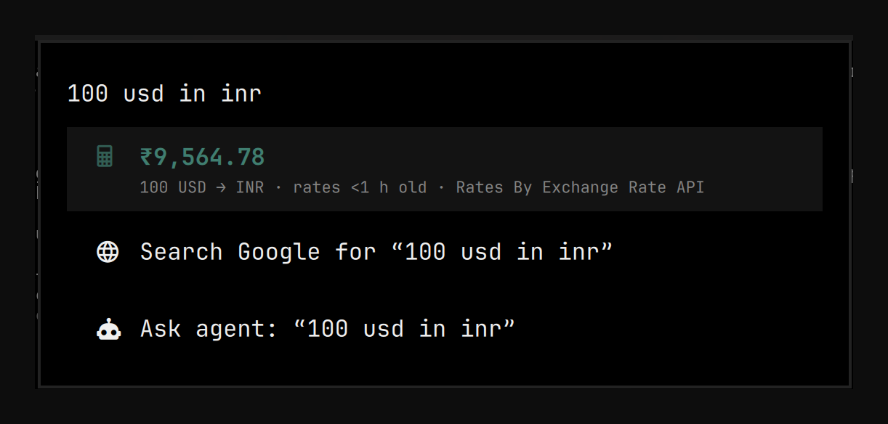
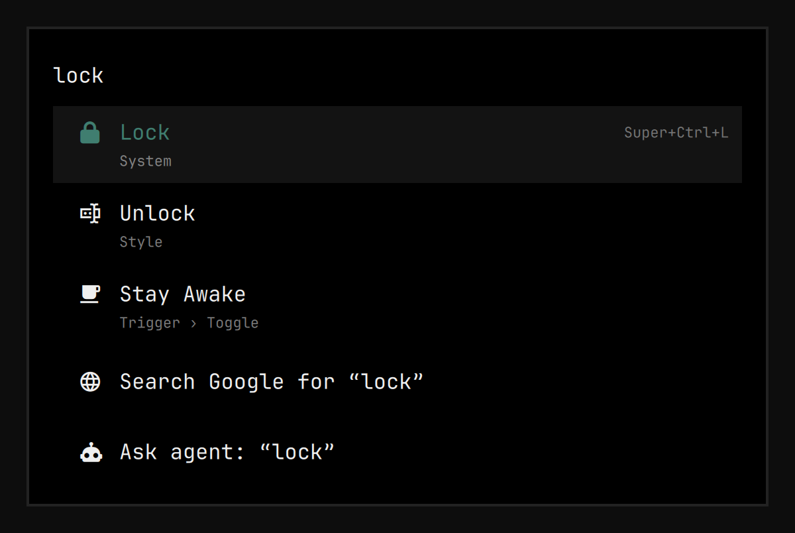
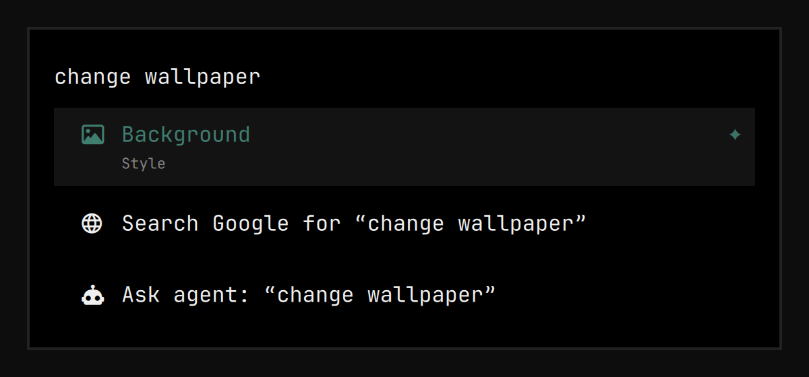
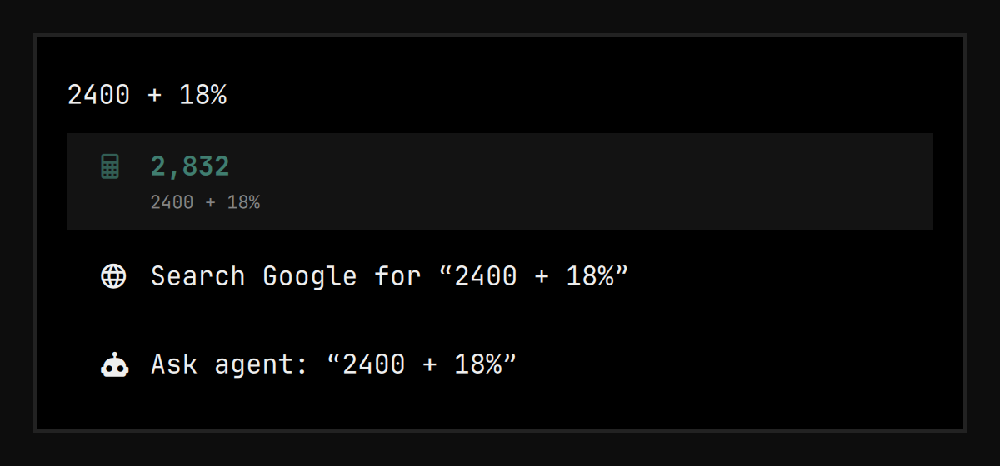
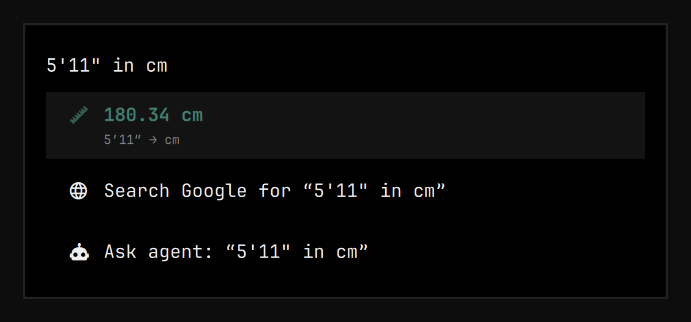
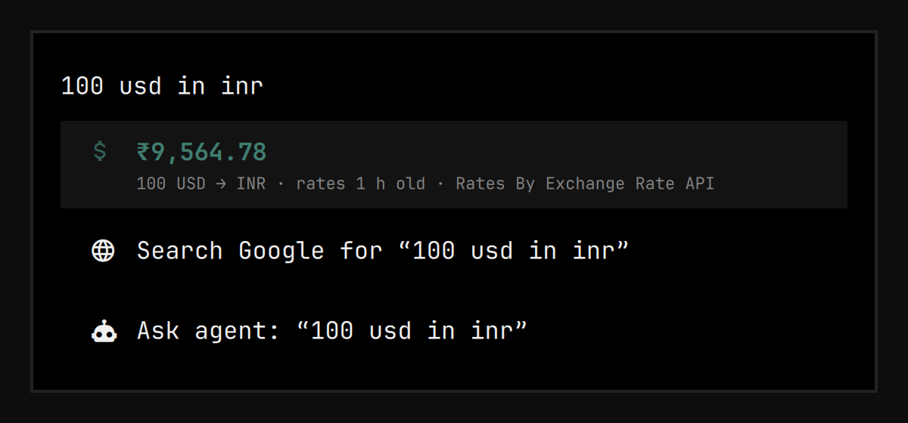
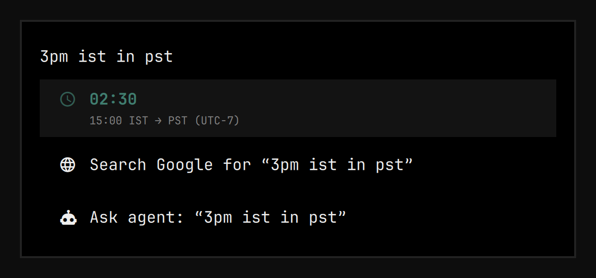
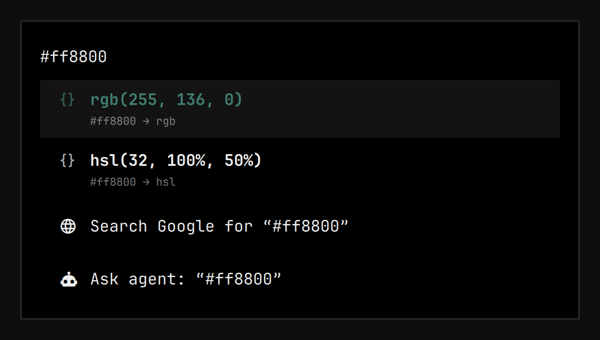
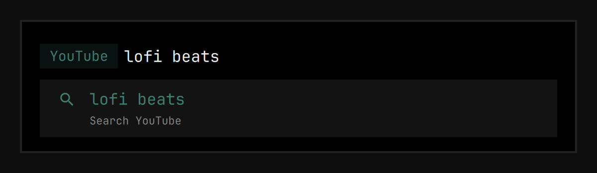
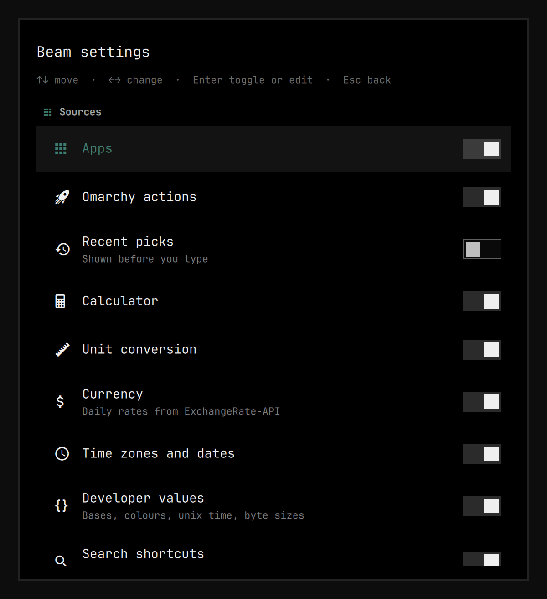

# Beam

One box for everything on [Omarchy](https://omarchy.org): launch apps, run
Omarchy actions, calculate and convert inline, search the web with shortcuts
and open URLs. With an optional [TypeSafe](https://typesafe.ai) Jev key it also
finds actions by what you *mean*: "screen warmer" finds Nightlight.



## Install

```bash
omarchy plugin add https://github.com/RohitKaushal7/omarchy-beam.git --enable
```

Then bind a key. Omarchy plugins cannot add keybindings themselves, so add
this to `~/.config/hypr/bindings.lua` (it replaces the default Apps menu key):

```lua
hl.unbind("SUPER + ALT + SPACE")
o.bind("SUPER + ALT + SPACE", "Beam", "omarchy-shell shell toggle dev.reuk.beam '{}'")
```

Requirements: Omarchy 4 and Python 3 (both ship with Omarchy). No other
dependencies.

## Use

Type, then press **Enter**.

| You type | You get |
|---|---|
| `slack`, `files` | the app, with its icon |
| `nightlight`, `reboot`, `theme` | Omarchy menu actions, with their keybinding |
| `screen warmer` | ✦ the action Jev thinks you mean (optional, needs a key) |
| `357/2` | `178.5`; Enter copies it |
| `yt` then **Tab**, `lofi beats` | a YouTube search in your browser |
| `github.com/omacom/omarchy` | opens the URL |
| anything else | web search, or **Ask agent** with your default coding agent |

Keys: **↑/↓** move · **Enter** run or copy · **Tab** search chip ·
**Ctrl+C** copy the selected value · **Ctrl+,** settings · **Esc** clear, then close.

Reboot, remove, update and install actions ask for a second Enter.

## Screenshots

<table>
  <tr>
    <td></td>
    <td></td>
  </tr>
  <tr>
    <td></td>
    <td></td>
  </tr>
  <tr>
    <td></td>
    <td></td>
  </tr>
  <tr>
    <td></td>
    <td></td>
  </tr>
</table>

## Calculator and conversions

| Kind | Examples |
|---|---|
| Arithmetic | `357/2` · `2(3+4)` · `sqrt 2` · `5!` · `10 mod 3` · `ans * 2` · `1,20,000 / 4` |
| Percentages | `18% of 2400` · `2400 + 18%` · `what % of 2400 is 432` |
| Units | `5 ft in cm` · `72f to c` · `3.2 GB in MiB` · `5'11" in cm` · `100 km/h in mph` · `5 kg` |
| Currency | `100 usd in inr` · `₹2400 to eur` · `$50` · `10k inr in usd` · `1 lakh inr in usd` |
| Time and dates | `3pm ist in pst` · `now in tokyo` · `days until dec 25` · `today + 90 days` · `in 3 weeks` · `what day is 15 aug 2027` |
| Developer | `0xff` · `255 in bin` · `#ff8800` · `rgb(255, 136, 0)` · `1700000000` · `now in unix` · `1536000 bytes` |

Currency rates come from [ExchangeRate-API](https://www.exchangerate-api.com)
(Rates By Exchange Rate API), fetched at most once a day and cached.

## Search shortcuts

Type a keyword (or the site's domain) and press **Tab**, or type the keyword,
a space and your search.

| Keyword | Searches |
|---|---|
| `g` | Google |
| `gg` | Google AI Mode |
| `yt` | YouTube |
| `ddg` | DuckDuckGo |
| `gh` | GitHub |
| `r` | Reddit |
| `maps` | Google Maps |
| `aw` | Arch Wiki |
| `aur` | AUR |
| `npm` | npm |
| `p` | Perplexity |
| `cl` | Claude |
| `x` | X |

Add or override shortcuts in Beam's entry in `~/.config/omarchy/shell.json`:

```json
{ "id": "dev.reuk.beam", "search": { "engines": [
  { "keyword": "amz", "name": "Amazon", "url": "https://www.amazon.in/s?k=%s" }
], "disabledBuiltins": ["x"] } }
```

## Jev (optional)

Jev is TypeSafe's fast classification model. When the name search finds
nothing strong and you pause typing, Beam asks Jev which app or action you
mean and adds it as a ✦ row. It never runs anything by itself.

Jev is off until you turn it on. Get a key from the
[TypeSafe console](https://console.typesafe.ai), then either export
`TYPESAFE_API_KEY` from your shell profile (Beam asks your login shell for it,
since the desktop session does not load rc files) or put the key in
`~/.config/typesafe/api_key`, and switch on **Use Jev** in Beam's settings
(**Ctrl+,**), which also shows whether Beam found the key. With Jev off,
everything else works as normal and nothing is sent to TypeSafe.

Usage and cost: `python3 ~/.config/omarchy/plugins/dev.reuk.beam/bin/beam.py stats`.

## Settings

**Ctrl+,** (or type `beam settings`) opens the settings view: turn each source
on or off, tune Jev, the calculator, the web-search engine, confirmations,
width and rows. It is keyboard-first: **↑/↓** move, **←/→** change numbers and
choices (**Shift** for bigger steps), **Enter** or **Space** flips a switch or
edits text, **Esc** goes back. Settings are stored on Beam's entry in
`~/.config/omarchy/shell.json`.



## Privacy

- **TypeSafe** (only when Jev is on and a key is found): what you typed plus
  the names of your apps and menu actions.
- **ExchangeRate-API**: one request for the rate table, at most once per
  refresh interval. Your amounts never leave the machine.
- **Search shortcuts and Ask agent** hand your text to the browser (in the
  URL) or the agent command (as its prompt argument), as any launcher does,
  so it shows in their command lines while they start.
- **On disk**, owner-only: recent picks (`~/.local/state/beam/recent.json`),
  a usage log of counts and timings trimmed to about 1 MiB
  (`~/.local/state/beam/usage.jsonl`), the Jev answer cache, keyed by hashes
  of what you typed, never the text (`~/.cache/beam/jev-cache.json`), and the
  rate table (`~/.cache/beam/rates.json`).
- Nothing you type is written to logs.

## Security

- **Network:** HTTPS to two fixed endpoints. Redirects are refused, so the
  TypeSafe key is only ever sent to `api.typesafe.ai`. Each request has a
  total deadline (8 s for rates, 6 s for Jev), not only per-read timeouts,
  and responses over 256 KiB are rejected before parsing.
- **Helper processes** (menu guards, keybinding hints, the hidden-app scan,
  clipboard paste, the key lookup) run under `timeout` with their output
  capped at the source, so a hung or runaway command can't stall or grow the
  shell. Commands are passed as arguments, never assembled as shell text;
  copied values reach `wl-copy` on stdin, not on its command line.
- **The key** is read from the environment, from your login shell (only while
  Jev is on; no stdin, 3 s, and only the value between marker bytes counts),
  or from the key file (a regular file of at most 4 KiB). It reaches the
  helper only through its environment, never a command line, log or file.
- **Files** are written atomically through randomly named temp files with
  owner-only permissions; reads are size-capped and accept regular files only.
- **Display:** every label is rendered as plain text, never rich text.

## How it runs

The box is a QML plugin inside `omarchy-shell`. Answers, conversions and Jev
calls come from a small Python helper (standard library only) that starts the
first time you open Beam, runs as `python3 -I` with a minimal environment, and
exits after 10 idle minutes. Menu actions run exactly as the Omarchy menu runs
them.

Two workarounds for the current Omarchy shell, both dropped automatically
once the shell behaves:

- The shell does not yet hand third-party menu plugins its app library, so
  Beam lists apps itself from the same desktop entries, with the same hidden
  entries and the same `gtk-launch` launcher.
- After `shell.json` changes, the shell does not refresh a kept-loaded
  plugin's handle to it, so Beam then saves its own entry in `shell.json` and
  closes itself through `omarchy-shell shell hide`.

## Troubleshooting

```bash
omarchy-shell shell call dev.reuk.beam status x   # helper, Jev and settings state
quickshell log -p "$OMARCHY_PATH/shell" -t 50     # shell log
```

Code changes to Beam take effect after `omarchy-restart-shell` (the plugin
stays loaded between opens).

## Development

```bash
cd ~/.config/omarchy/plugins/dev.reuk.beam
python3 -m unittest discover -s tests -t tests
node --test tests/lib/
omarchy plugin validate .
```

Beam stays loaded between opens, so run `omarchy-restart-shell` after editing
its QML. `python3 bin/beam.py eval "5 ft in cm"` prints the engine's answer for
a query.

## Remove

```bash
omarchy plugin remove dev.reuk.beam
```

## License

MIT
